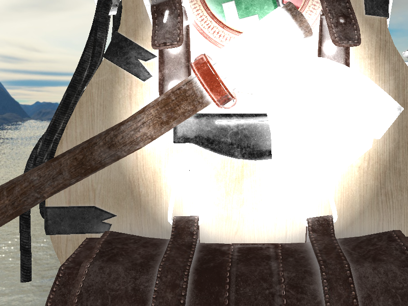

OpenGL in Qt

===========

This is my work following the tutorial at [Learn OpenGL](https://learnopengl.com/), but on Qt platform.

Implemented features:
 - Mouse and Keyboard control
 - Saving screenshots
 - Loading model via assimp
 - Skybox
 - Environment Mapping
 - Cook-Torrence BRDF 

